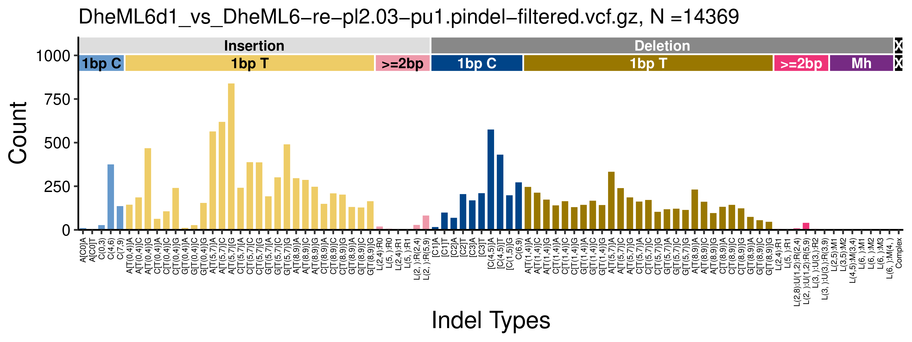
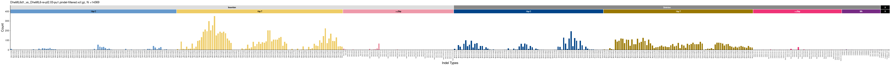

# **indelsig.tools.lib**

An R package for indel signature analysis. 

## Installation

You can either download the `indelsig.tools.lib` repository, enter in the package folder.

```
git clone https://github.com/Nik-Zainal-Group/indelsig.tools.lib

cd indelsig.tools.lib
```

Then install the package using `devtools`.

```
install.packages("devtools")
devtools::install()
```

Or you can install the package directly from the R environment:


```
install.packages("devtools")
devtools::install_github("Nik-Zainal-Group/indelsig.tools.lib")
```

### Note for MacOS users:

If you encounter this problem while R is installing `NNLM`:

```
ld: warning: search path '/opt/gfortran/lib/gcc/aarch64-apple-darwin20.0/12.2.0' not found
ld: warning: search path '/opt/gfortran/lib' not found
ld: library 'gfortran' not found
```
You can simply install `gfortran` pkg file from the following Github page:

```
https://github.com/R-macos/gcc-12-branch/releases
```

*Source*:
```
https://stackoverflow.com/questions/77836548/library-gfortran-not-found-when-installing-r-packages
```

## Main Functions

### Indel segmentation and filtering


-   indel_classifier89(indels, genome.v): Segments the indels provided by adding the necessary information to generate the 89-channel catalogues
    -   indels: data.frame of indels having columns: "Sample", "chr", "position", "REF", "ALT"
    -   genome.v: either "hg19" or "hg38"

-   indel_classifierfull(indels, genome.v): Segments the indels provided by adding the necessary information to generate the 476-channel catalogues
    -   indels: data.frame of indels having columns: "Sample", "chr", "position", "REF", "ALT"
    -   genome.v: either "hg19" or "hg38"

-   indel_highspecific(indel.classified): Filters out indels in highly repeated regions (\>= 10 repeats) and indels longer than 100 bps
    -   indel.classified: the output of either `indel_classifier89` or `indel_classifierfull`


### Generating indel catalogues

-   gen_catalogue89(muts_list, sample_col):
    -   muts_list: either the output of `indel_classifier89` or `indel_highspecific`
    -   sample_col: name or index of the column storing the sample names

-   gen_fullcatalogue(muts_list, sample_col):
    -   muts_list: either the output of `indel_classifierfull` or `indel_highspecific`
    -   sample_col: name or index of the column storing the sample names


### Plotting indel catalogues

-   plots_indelprofile_89ch(muts_basis, colnum,h, w, text_size,print_Xlabel = T, outputname)
    -   muts_basis: catalogue data frame
    -   colnum: Number of columns in case multiple samples are plotted
    -   h: Height (inches for PDF and px for PNG) of file 
    -   w: Width (inches for PDF and px for PNG) of file
    -   text_size: Text size of plot elements defining the channels
    -   print_Xlabel: if `TRUE` then the X axis labels are printed
    -   outputname: if `NUL`L the plot with be returned and printed, if it is a path then indelsig.tools.lib will print the plot to file.
    -   print_png: boolean, default = `TRUE`; if `TRUE` indelsig.tools.lib will save the plot to a png file
    -   print_pdf: boolean, default = `FALSE`; if `TRUE` indelsig.tools.lib will save the plot to a pdf file

-   plots_indelprofile_full(muts_basis, colnum,h, w, text_size,print_Xlabel = T, outputname)
    -   muts_basis: catalogue data frame
    -   colnum: Number of columns in case multiple samples are plotted
    -   h: Height (inches for PDF and px for PNG)  
    -   w: Width (inches for PDF and px for PNG) of file
    -   text_size: Text size of plot elements defining the channels
    -   print_Xlabel: if `TRUE` then the X axis labels are printed
    -   outputname: if `NUL`L the plot with be returned and printed, if it is a path then indelsig.tools.lib will print the plot to file.
    -   print_png: boolean, default = `TRUE`; if `TRUE` indelsig.tools.lib will save the plot to a png file
    -   print_pdf: boolean, default = `FALSE`; if `TRUE` indelsig.tools.lib will save the plot to a pdf file

## Usage example


### Generating and plotting 89-channel catalogues 
```         
library(indelsig.tools.lib)

file_path <- "example/DheML6d1_vs_DheML6-re-pl2.03-pu1.pindel-filtered.vcf.gz"

mutations <- read.table(file_path)[c(3,1,2,4,5)] ## Adjust the input for indel segmentation and classification
mutations$V3 <- basename(file_path) ## Replace column with sample name
colnames(mutations) <- c("Sample", "chr", "position", "REF", "ALT")
mutations
# > head(mutations)
#                                                    Sample  chr position  REF ALT
# 1 DheML6d1_vs_DheML6-re-pl2.03-pu1.pindel-filtered.vcf.gz chr1  1062599   TC   T
# 2 DheML6d1_vs_DheML6-re-pl2.03-pu1.pindel-filtered.vcf.gz chr1  1209067   CG   C
# 3 DheML6d1_vs_DheML6-re-pl2.03-pu1.pindel-filtered.vcf.gz chr1  1361437   TC   T
# 4 DheML6d1_vs_DheML6-re-pl2.03-pu1.pindel-filtered.vcf.gz chr1  1406864 GGCC   G
# 5 DheML6d1_vs_DheML6-re-pl2.03-pu1.pindel-filtered.vcf.gz chr1  1483467    C  CA
# 6 DheML6d1_vs_DheML6-re-pl2.03-pu1.pindel-filtered.vcf.gz chr1  1679489   GA   G

mutations <- indelsig.tools.lib::indel_classifier89(mutations, genome.v = "hg38")
# Indel-specific preps
# 
# 
# 
# Running segmentation

dim(mutations)
# [1] 14372    35

mutations <- indelsig.tools.lib::indel_highspecific(mutations)

dim(mutations)
#[1] 14369    35                                   # 3 Mutations have been filtered out

mutations <- indelsig.tools.lib::gen_catalogue89(mutations, sample_col = 1)
dim(mutations)
# [1] 89  1

# Plot to file
plots_indelprofile_89ch(mutations, colnum = 1, h = 3, w = 8,text_size = 3, outputname = "example/example_plot")

#or 

plots_indelprofile_89ch(mutations, colnum = 1, h = 3, w = 8,text_size = 3, outputname = NULL)
```




### Generating and plotting 476-channel catalogues

```
library(indelsig.tools.lib)
file_path <- "example/DheML6d1_vs_DheML6-re-pl2.03-pu1.pindel-filtered.vcf.gz"


mutations <- read.table(file_path)[c(3,1,2,4,5)] ## Adjust the input for indel segmentation and classification
mutations$V3 <- basename(file_path) ## Replace column with sample name
colnames(mutations) <- c("Sample", "chr", "position", "REF", "ALT")
mutations
# > head(mutations)
#                                                    Sample  chr position  REF ALT
# 1 DheML6d1_vs_DheML6-re-pl2.03-pu1.pindel-filtered.vcf.gz chr1  1062599   TC   T
# 2 DheML6d1_vs_DheML6-re-pl2.03-pu1.pindel-filtered.vcf.gz chr1  1209067   CG   C
# 3 DheML6d1_vs_DheML6-re-pl2.03-pu1.pindel-filtered.vcf.gz chr1  1361437   TC   T
# 4 DheML6d1_vs_DheML6-re-pl2.03-pu1.pindel-filtered.vcf.gz chr1  1406864 GGCC   G
# 5 DheML6d1_vs_DheML6-re-pl2.03-pu1.pindel-filtered.vcf.gz chr1  1483467    C  CA
# 6 DheML6d1_vs_DheML6-re-pl2.03-pu1.pindel-filtered.vcf.gz chr1  1679489   GA   G


mutations <- indelsig.tools.lib::indel_classifier_full(mutations, genome.v = "hg38")
# Indel-specific preps
# 
# 
# 
# Running segmentation

dim(mutations)
# [1] 14508    35

mutations <- indelsig.tools.lib::indel_highspecific(mutations)

dim(mutations)
#[1] 14369    35                                   # 3 Mutations have been filtered out

mutations <- indelsig.tools.lib::gen_fullcatalogue(mutations, sample_col = 1)
dim(mutations)
# [1] 476  1

# Plot to file to pdf
plots_indelprofile_full(mutations, colnum = 1, h = 3, w = 40,text_size = 3, outputname = "example/example_plot476")

plots_indelprofile_full(mutations, colnum = 1, h = 300, w = 4000,text_size = 3, outputname = "example/example_plot476", print_png = T)

#or 

plots_indelprofile_full(mutations, colnum = 1, h = 3, w = 8,text_size = 3, outputname = NULL)
```


